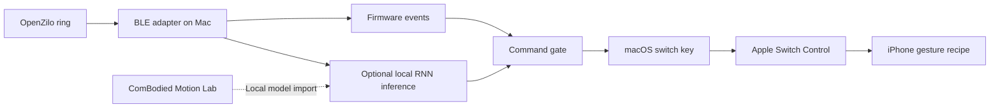

<div align="center">

# OpenZilo-PhoneControl

**Wearable input. Local processing. iPhone interaction.**

A macOS-to-iPhone control bridge for **ComBodied AI**, built on the public OpenZilo Python SDK.

[](https://github.com/jzjzzzzzzz/OpenZilo-PhoneControl/actions/workflows/ci.yml)


[Quick start](#quick-start) · [iPhone setup](docs/setup-iphone.zh-CN.md) · [Model integration](docs/models.md) · [Architecture](docs/architecture.md)

**English** | [简体中文](README.zh-CN.md)

</div>

---

OpenZilo-PhoneControl maps smart-ring button and gesture input to iPhone actions through a local Mac. The initial application is advancing videos in the **Douyin iPhone app** using Apple Switch Control. Processing stays on the Mac; the application does not require a cloud service or an additional iPhone app.

The project connects two complementary components:

- **[OpenZilo](https://github.com/ziloai/OpenZilo)** provides the public device SDK and protocol parsers.
- **[ComBodied Motion Lab](https://github.com/jzjzzzzzzz/combodied-motion-lab)** provides the optional RNN training and inference runtime.

This is an independent application-layer project, not an official OpenZilo or Apple release.

## Capabilities

- **Verified device sessions.** BLE discovery, physical CPUID verification, reconnect handling and bounded queues.
- **Two input paths.** Discrete firmware events without model weights, or local IMU inference using an imported Motion Lab RNN.
- **Controlled command output.** Duplicate suppression, stale-event rejection, cooldowns, pause/resume and key-release cleanup.
- **Model separation.** Import locally trained NPZ models with checksum, label, preprocessing and sensor-contract validation. No pretrained weights are distributed.
- **Inspectable operation.** Dry-run mode, offline replay, local diagnostics and automated tests.

## Architecture



The Mac remains part of the runtime. This is not direct ring-to-iPhone HID firmware, and it does not operate an iPhone Mirroring window. See [architecture and execution boundaries](docs/architecture.md).

## Requirements

- macOS, Python 3.11+, Git and a compatible OpenZilo ring.
- An iPhone and Mac using the same Apple Account and Wi-Fi network for Apple's platform switching.
- macOS Accessibility permission for the process that emits switch keys.
- A configured iPhone Switch Control recipe that turns the received switch into one upward swipe.

The public SDK dependency is pinned to a reviewed OpenZilo commit. No private SDK folder, firmware image or historical development environment is required.

## Quick start

### 1. Install and validate the local application

```bash
git clone https://github.com/jzjzzzzzzz/OpenZilo-PhoneControl.git
cd OpenZilo-PhoneControl
./setup.sh

./ringphone doctor
./ringphone replay
```

`setup.sh` creates `.venv` and installs the application, public SDK and optional NumPy inference dependency. It does not download model weights or change system accessibility settings. To install only the default firmware-event path, use `python -m pip install -e .` in your own environment.

### 2. Validate the iPhone action independently

Follow the [iPhone setup and acceptance procedure](docs/setup-iphone.zh-CN.md), then test one switch key:

```bash
./ringphone test-key --key SPACE --delay 5
```

The acceptance criterion is **one upward swipe on the actual iPhone**, not merely a successful terminal message. Apple's [cross-device Switch Control](https://support.apple.com/en-us/118667) and [iPhone recipes](https://support.apple.com/guide/iphone/iph400b2f114/ios) provide the system-level control path; the exact remote-switch/recipe combination must be verified on the target OS versions.

### 3. Connect the ring

```bash
./ringphone scan
./ringphone pair
./ringphone monitor --duration 30
./ringphone run --dry-run
```

If multiple candidates are present, specify `pair --address DEVICE_UUID` or `pair --cpuid DEVICE_CPUID`. Existing local profiles can be imported with `pair --profile /path/to/profile.json`; the device is reverified before saving the new binding.

### 4. Enable output after the phone-side test passes

```bash
./ringphone run --enable-output
```

The default mapping is **button double-press → next video** through the `SPACE` switch. A single button press is reserved for the firmware's mode change and never mapped to a phone action.

Type `p` + Enter to pause, `r` + Enter to resume, or `q` + Enter to stop. `Ctrl-C` also stops the bridge. To keep the Mac awake during a session:

```bash
caffeinate -i ./ringphone run --enable-output
```

## Input modes

| Mode | Command | Model required | Interaction |
| --- | --- | --- | --- |
| Button events | `run --dry-run` | No | Double-press the ring button |
| Firmware gestures | `run --preset gesture --dry-run` | No | Enter gesture mode, then hold, move and release |
| Imported RNN | `run --source rnn --model gesture-rnn --preset rnn --dry-run` | Local NPZ | Enter gesture mode and stream IMU data |

Firmware gestures are not the same as continuous RNN recognition. Firmware single-press events do not prove a mode change succeeded. The RNN path explicitly starts IMU reporting and verifies sensor parameters against the imported model contract.

## Train elsewhere, import locally

Training methods, dataset preparation and evaluation are maintained in **[ComBodied Motion Lab](https://github.com/jzjzzzzzzz/combodied-motion-lab)**, particularly its [training guide](https://github.com/jzjzzzzzzz/combodied-motion-lab/blob/main/docs/training.md) and [data format](https://github.com/jzjzzzzzzz/combodied-motion-lab/blob/main/docs/data-format.md).

This repository does not duplicate training code or publish the actual RNN model. After obtaining a compatible export:

```bash
./ringphone model import /path/to/gesture-rnn.npz \
  --name gesture-rnn \
  --lab /path/to/combodied-motion-lab \
  --sample-rate 100 --accel-range 16 --gyro-range 2000

./ringphone model inspect gesture-rnn
./ringphone run --source rnn --model gesture-rnn --preset rnn --dry-run
```

Use the **actual training sampling rate and sensor ranges**, not the example values blindly. The default RNN preset expects `idle`, `up` and `down`; adapt the configuration to your model's labels. Feature versions v1–v3 are supported through the upstream runtime. The v4 window-local preprocessing path requires explicit opt-in and validation against the training setup. See [model compatibility and import contracts](docs/models.md).

## Validation status and scope

| Component | Validation boundary |
| --- | --- |
| Event gates, BLE adapter, model import and lifecycle | Automated tests with synthetic inputs and simulated GATT |
| Real macOS key posting | Implemented; requires local Accessibility permission |
| iPhone recipe execution and Douyin navigation | Manual device acceptance required; no phone-side acknowledgement is available |
| RNN recognition quality | Depends on the imported model and representative local evaluation |
| Previous-video action | Disabled by default until a second independent remote switch is verified |

`posted_keys` counts Mac key submissions, **not successful iPhone actions**. The bridge cannot determine whether Douyin is in the foreground. Pause it before switching apps. See [testing](docs/testing.md) and [troubleshooting](docs/troubleshooting.md).

## Development

```bash
.venv/bin/python -m unittest discover -s tests -v
.venv/bin/python scripts/check_release.py --tracked
```

Optional model integration tests use a separately obtained Motion Lab checkout via `COMBODIED_MOTION_LAB_PATH`. CI obtains pinned public sources and creates temporary synthetic test weights; no real device data or trained weights are required.

## Documentation

| Guide | Contents |
| --- | --- |
| [iPhone setup](docs/setup-iphone.zh-CN.md) | Mac switches, phone recipes and acceptance steps |
| [Model integration](docs/models.md) | Local imports, metadata and preprocessing contracts |
| [Architecture](docs/architecture.md) | Device, model, command and output boundaries |
| [Testing](docs/testing.md) | Automated checks and manual acceptance |
| [Release boundary](PUBLIC_RELEASE.md) | Included files, exclusions and publication audit |
| [Contributing](CONTRIBUTING.md) | Development workflow |
| [Security](SECURITY.md) | Private reporting and reproducible diagnostics |

## Ecosystem and licensing

GitHub topics include **`combodied-ai`** and **`openzilo`**. The project explores wearable interaction within the ComBodied AI ecosystem; upstream marks remain with their owners.

No project-wide open-source license has been granted for this application snapshot. License selection remains a maintainer decision. Public dependencies retain their own terms; see [third-party notices](THIRD_PARTY_NOTICES.md). The OpenZilo SDK's license does not automatically license this application or imported model weights.
