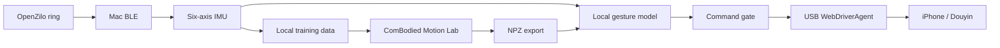

<div align="center">

# OpenZilo-PhoneControl

**Ring IMU → local inference → iPhone interaction**

[](https://github.com/jzjzzzzzzz/OpenZilo-PhoneControl/actions/workflows/ci.yml)


[Quick start](#quick-start) · [IMU example](demo/README.md) · [Train your model](#train-your-model) · [USB setup](docs/wda.md)

**English** | [简体中文](README.zh-CN.md)

</div>

OpenZilo-PhoneControl connects an OpenZilo ring to an iPhone through a local Mac.
It records labeled six-axis IMU sessions, imports portable gesture models, and
maps recognized actions to Douyin feed navigation over USB WebDriverAgent.

## Features

- Verified BLE discovery, pairing and ring IMU collection.
- Local GRU inference with idle re-arming, confidence checks and command cooldown.
- Portable NPZ export/import, sensor-contract checks and runtime checksums.
- USB WDA phone control: next item, previous item and interactive console.
- A small trained synthetic IMU model with reproducible inputs and exported results.
- Offline replay, local diagnostics and automated integration tests.

## Architecture



The model runs on the **Mac**. The iPhone receives gesture commands through WDA;
model weights are not installed into Douyin. The project builds on the public
[OpenZilo SDK](https://github.com/ziloai/OpenZilo) and
[ComBodied Motion Lab](https://github.com/jzjzzzzzzz/combodied-motion-lab).

## Requirements

- macOS, Python 3.11+ and a compatible OpenZilo ring.
- USB-connected iPhone with developer mode and UI automation enabled.
- Xcode supporting the phone's iOS version; a signed WDA Runner running on the phone.
- A separately obtained Motion Lab checkout for model import and inference.

## Quick start

### 1. Install

```bash
git clone https://github.com/jzjzzzzzzz/OpenZilo-PhoneControl.git
cd OpenZilo-PhoneControl
./setup.sh
./ringphone doctor
```

Obtain the matching model runtime:

```bash
git clone https://github.com/jzjzzzzzzz/combodied-motion-lab.git ../combodied-motion-lab
git -C ../combodied-motion-lab checkout 839ecc0bc89fd560e29eb6cc1b41f17afe5a51d7
```

### 2. Run the IMU export example

```bash
.venv/bin/python scripts/demo_imu.py \
  --lab ../combodied-motion-lab --output results/imu-demo.json
```

The example imports `demo/imu-baseline.npz`, processes three six-axis windows and
exports class probabilities and mapped actions. Published results are in
[demo/predictions.json](demo/predictions.json).

| Input | Prediction | Probability | Action |
| --- | --- | ---: | --- |
| down | down | 0.999478 | previous |
| idle | idle | 0.999911 | — |
| up | up | 0.999727 | next |

**Example model:** 1,692 parameters, 12,777 bytes, trained on synthetic IMU data.
For your own ring, collect labeled recordings and train your own model using the
workflow below. The example is included to demonstrate the export/import format.

### 3. Connect the phone

Follow the [WDA setup guide](docs/wda.md), then leave the Xcode WDA test running.
Start USB forwarding in a separate terminal:

```bash
.venv/bin/python scripts/wda_usb.py
```

With Douyin open on the phone:

```bash
./ringphone phone next --enable-output
./ringphone phone previous --enable-output
./ringphone phone console --enable-output
```

Console commands: `u` + Enter for next, `d` + Enter for previous, `q` + Enter to exit.
The default local WDA endpoint is `http://127.0.0.1:18100`.

## Train your model

### Collect labeled ring sessions

```bash
./ringphone scan
./ringphone pair
./ringphone record --label idle --duration 3
./ringphone record --label up --duration 3
./ringphone record --label down --duration 3
```

Enter the ring's gesture mode before collection. Repeat captures for each label
across complete recording sessions. Files are saved under `captures/` using the
[ring-imu/v1 format](https://github.com/jzjzzzzzzz/combodied-motion-lab/blob/main/docs/data-format.md).

### Train and export

Install Motion Lab's training dependencies in your training environment, then:

```bash
python scripts/train_ring_model.py --lab ../combodied-motion-lab \
  --data 'captures/*.jsonl' \
  --output models/my-ring.npz --report results/my-ring-training.json \
  --window-seconds 1.6 --stride-seconds 0.2 --target-steps 40 \
  --hidden-size 32 --epochs 60
```

This entry point uses the pinned Motion Lab trainer with the matching v3 input
contract. See [training and evaluation](https://github.com/jzjzzzzzzz/combodied-motion-lab/blob/main/docs/training.md)
for dataset partitioning and evaluation methods.

### Import and run

```bash
./ringphone model import models/my-ring.npz --name my-ring \
  --lab ../combodied-motion-lab \
  --sample-rate 100 --accel-range 16 --gyro-range 2000
./ringphone model inspect my-ring
./ringphone run --source rnn --model my-ring --preset rnn --backend wda --dry-run
./ringphone run --source rnn --model my-ring --preset rnn --backend wda --enable-output
```

Use the sampling rate and ranges from your capture report. `up` maps to next,
`down` to previous; `idle` re-arms recognition. Type `p`, `r` or `q` followed by
Enter to pause, resume or stop. The bundled example is for offline model-format
verification; live output uses your own trained model.

## Validation

- The bundled example passed export, import and NumPy/PyTorch inference parity checks.
- Integration tests cover IMU prediction, recognition gates and WDA command routing.
- USB WDA status and Douyin application identification were checked on an iPhone 14;
  feed navigation was exercised through the device API.

```bash
COMBODIED_MOTION_LAB_PATH=../combodied-motion-lab \
  .venv/bin/python -m unittest discover -s tests -v
.venv/bin/python scripts/check_release.py
```

## Documentation

| Guide | Content |
| --- | --- |
| [中文操作流程](docs/quickstart.zh-CN.md) | Collection, training, import and phone operation |
| [IMU example](demo/README.md) | Model card, input windows and exported probabilities |
| [Model integration](docs/models.md) | Import format, normalization and runtime contract |
| [USB WDA](docs/wda.md) | Phone installation, forwarding and control |
| [Architecture](docs/architecture.md) | Input, model and output components |
| [Publication boundary](PUBLIC_RELEASE.md) | Public assets and local data |
| [Validation](docs/validation.md) | Model export results and application checks |

Personal recordings, device identities, signing materials and locally trained
models stay outside the publication snapshot. Only the named synthetic demo
model is distributed. Component terms are listed in [third-party notices](THIRD_PARTY_NOTICES.md).

GitHub topics: **combodied-ai · openzilo**.
